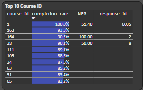
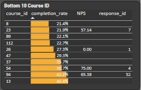
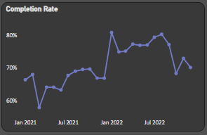
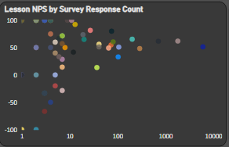

# Analyzing-Course-Performance

## Table of contents
- [Introduction](#introduction)
   - [Objective](#objective)
   - [Data Preparation and processing](#data-preparation-and-processing)
   - [Metrics Used](#metric-used)
- [Findings](#findings)
- [Recommendations](#recommendations)

---

## Introduction

Dataquest delivers career-path and skill-path courses via hands-on, project-based learning. As their course offerings expand, relying solely on qualitative feedback becomes insufficient for evaluating course effectiveness and learner satisfaction.

### Objective 

- Identify lessons that need improvement using data-driven insights.

- Develop a Power BI dashboard to visualize course quality via key performance metrics.

### Data Preparation and processing

Three CSV files were provided: one mapping course and lesson IDs, one with Net Promoter Scores (NPS), and another containing lesson completion rates. Because not all lessons appear in every file, the analysis focuses exclusively on lessons common to all three datasets to ensure consistency and accuracy.
 
               
### Metrics Used

- **Lesson Completion Rate:** Indicates learner engagement and curriculum clarity. A high rate suggests effective content; a low rate may point to issues.

- **Net Promoter Score (NPS):** Measures learner satisfaction on a scale from –100 to 100, based on how likely they are to recommend the course.
  

## Findings

#### Top Performers:

- Course ID 1 achieved a **100% completion rate**, but with an **NPS of 51**, indicating completion without high satisfaction.

- Course ID 164 had a **91% completion rate**, paired with a perfect **NPS of 100**, showing both engagement and high satisfaction.

#### Courses Needing Attention:

- Course IDs **8, 23, 89, 112, 26, 47, 37, 54, 94,** and **13** have among the **lowest completion rates** and are the **least likely to be recommended**.

## Recommendations

Focus improvements on lessons meeting any of these criteria:

- Completion rate below 50%

- NPS below 50

- Meeting both of the above thresholds

 

**Data Limitations to Address**

There are also three data limitations that would make the results much more robust if addressed:

- Missing course IDs

- Missing response IDs

- Lessons with fewer than 15 NPS survey responses

      
 
[ <a href="#table-of-contents">↑ Back to top ↑</a> ]

                        

