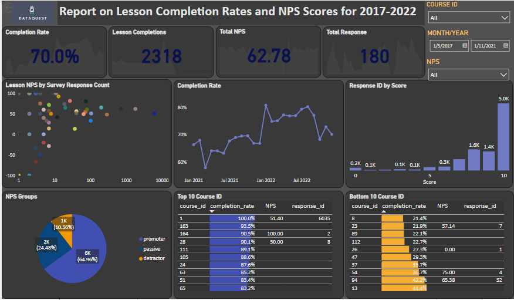

# Analyzing-Course-Performance

## Table of contents
- [Introduction](#introduction)
   - [Objective](#objective)
   - [Data organization and process](#data-organization-and-process)
   - [Metric](#metric)
- [Findings](#findings)
- [Recommendations](#recommendations)

---

## Introduction
Dataquest is an online data analysis and data science instruction service that offers career path courses (which can be completed in about 45 weeks) and skill paths courses with related lessons that teaches through challenging exercises and real-world projects.
Courses are the most important part of Dataquest's business. Having high-quality, effective, and engaging courses is a top company priority. 

### Objective 
As the course catalogue grows, it becomes more difficult to rely purely on qualitative data.
-	Provide feedback on which lessons to improve.
- Build a power BI app that surfaces quantitative data on course quality.

  
### Data organization and process
Three csv files were provided: a file with course and lesson ID numbers, a file with net promoter scores (NPS), and a file with lesson completion rates. The primary limitation of the report is the quality of the data. Each file contains lessons that are missing in the others. I chose to limit the report to lessons that only occur across all three files.
This project made use of DB Browser for SQLite to handle the databases and were queried with different codes to obtain insights necessary to increase donations.

 
               
### Metric

*Lesson Completion Rate*

Lesson completion rate metric was used in this report to understand the course quality. Lessons with high completion rates show that learners understand the curriculum and are engaged enough to complete the lesson. Low completion rates suggest there may be an issue that needs to be addressed.

*Net Promoter Score*

Net promoter score (NPS) metric was used to measure customer satisfaction. The resulting metric gives a number between -100 and 100. It's calculated from the results of a survey question that asks, "On a scale of 1-10, how likely are you to recommend this product to others?". Dataquest students receive periodic NPS surveys, and the results are used to measure lesson and course quality.

## Findings
Top 10 and bottom 10 analysis was performed to show the course with the highest and lowest completion rate and the learners experience taking the course.

*Top Ten Analysis*

The analysis shows the top 10 course id with the highest completion rate and their net promoter score (NPS) that shows how likely they are to recommend the course to someone interested in learning data skills. Course ID 1 with the highest completion rate of 100 percent, shows that these learners understand the curriculum and are engaged enough to complete the lesson; but with an NPS of 51 (the detractors), shows that the learners are not satisfied about their experience even though they completed the course. And course ID 164 with 91 percent completion rate, and the highest NPS of 100 (the promoters), shows that the learners understood the curriculum but didn’t engage enough to complete the lesson, however, are enthusiastic about their experience and likely to refer it to others. 

*Bottom Ten Analysis*

It is discovered in the analysis that the course ID 8, 23, 89, 112, 26, 47, 37 54, 94, and 13 has the lowest lesson completion rate and are less likely to recommend the course to others.

## Recommendations

The following are three suggestions for which lessons to improve.

- Lessons with a completion rate of less than 50%. 
- Lessons with a NPS of less than 50%.
- Lessons with both less than 50%.

  

 There are also three data limitations that would make the results much more robust if addressed. 
- Many entries have no Course ID. 
- Many entries have no response ID 
- Many entries have fewer than 15 NPS surveys.

         
 
[ <a href="#table-of-contents">↑ Back to top ↑</a> ]

                        

