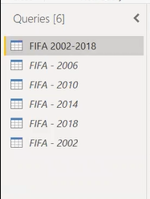
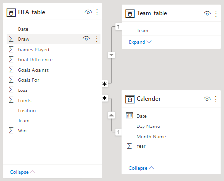
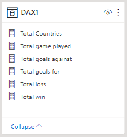
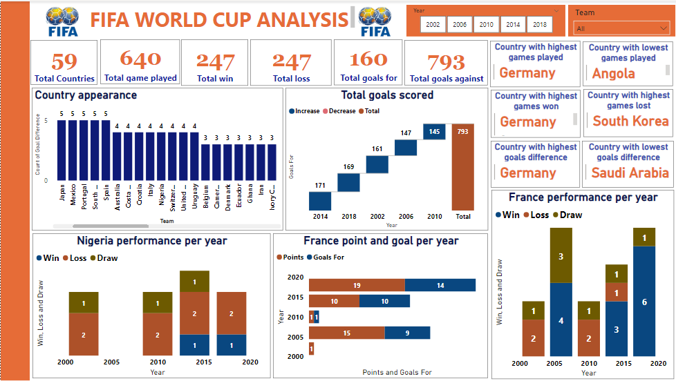

#  FIFA WORLD CUP ANALYSIS**

## Table of contents

1. [Introduction](#introduction)
   
2. [Data preparation](#data-preparation)
   - [Data organization and process](#data-organization-and-process)
   - [Load and view the data set](#load-and-view-the-data-set)
   - [Data cleaning](#data-cleaning)
   - [Data model](#data-model)
   - [DAX](#dax)

3. [Findings](#findings)
   
4. [Tailored Analysis](#tailored-analysis)
   - [The total goals scored](#the-total-goals-scored)
   - [France points and goals per year](#france-points-and-goals-per-year)
   - [France performance per year](#france-performance-per-year)
   - [Nigeria performance per year](#nigeria-performance-per-year)
   
5. [Conclusion](#conclusion)
   - [Analysis of countries performance](#analysis-of-countries-performance)
   - [Dashboard overview](#dashboard-overview)[Recommendations](#recommendations)

 
## Introduction 
This project involves generating insight from 5 years dataset of the FIFA world cup tournament 
participated by 59 countries from different continents of the world. 
The following questions was asked to generate clear insight; 
-	How many countries have played in the world cup (5 Years)? 
-	Get the total games played; win, loss, Goals for/against. 
-	The country with the highest and lowest appearance in the last five years? 
-	The country with the highest and lowest games played. 
-	The country with the highest and lowest games won. 
-	The country with the highest and lowest games lost. 
-	The country with the highest and lowest goals for? 
-	The country with the highest and lowest goals against? 
-	The country with the highest and lowest goals difference? 
-	The country with the highest and lowest points? 
-	What is the trend of total goals scored in the last 5 years?
-	What is France performance in goal-for and point?
-	What is the trend of games won and lost by France in the last five years?
-	What is the trend of games won and lost by Nigeria in the last five years?

## Data Preparation

### Data organization and process
The data set used for the purpose of this analysis is a public dataset available as 5 csv files that explores 5 years dataset of FIFA world cup. The data set contains data such as; year, position, win, draw, loss, goals for, goals against, goal difference, points and team. For the purpose of this case study and analysis, I will be using power BI so I can bring in the 5 files at ones. Power BI will bring in the queries as csv file, transform and load.

### Load and view the data set

### Data cleaning
Change data types, remove duplicates, merge query, change column names, replace values, extract year and split columns, remove irrelevant columns and close and apply.

### Data model
I created a relationship by connecting team from FIFA table with team from team table, created a calendar table and connecting date from calendar table with date from FIFA table.

### DAX
Data analysis expressions (DAX) was introduced by creating new measures to calculate; the total countries that played in the world cup, total win, total game played, total loss, total goal for/against.

[ <a href="#table-of-contents">↑ Back to top ↑</a> ]

## Findings
 
In the given dataset, 59 countries played the FIFA world cup. 640 games were played, win and loss games were 247 games respectively and total goals were 793. 
The country with the highest appearance in the last five years were; Argentina, Brazil, England, France, Germany, Japan, Mexico, Portugal, South Korea and Spain with 5 appearances respectively, while the country with the lowest appearance were; Angola, Bosnia and Herzegovina, China PR, Czech Republic, Egypt, Iceland, Morocco, New Zealand, North Korea, Panama, Peru, Republic of Ireland, Serbia and Montenegro, Slovakia, Togo, Trinidad and Tobago, Turkey and Ukraine with 1 appearance respectively.
The countries with the highest and lowest games played were; Germany played 13 games while 
Angola and 13 other countries played total games of 3 each.

The countries with the highest and lowest games won were Germany and Angola with total games won in 5years as 22 and 0 respectively. 
The countries with the highest and lowest games lost were South Korea and Angola, 9 and 1 
respectively. 
The countries with the highest and lowest number of goals were Germany with 64 goals and Angola with 1 goal. 
Brazil has the highest number of goals against with a total number of 27 and Angola has the lowest goals-against against 2. 
Germany has the highest goals difference while Saudi Arabia has the lowest goals difference.
Germany has the highest points of 69 while China PR has the lowest point of 0.

## Tailored analysis

### The total goals scored 
The total goal scored in the 5 years FIFA world cup dataset was 793 goals, of which; the highest and lowest goals was scored in 2014 and 2010 total goals of 171 and 145 respectively. 
However, in 2018, 2002, and 2006 goals scored were 169, 161, and 147 respectively. 

### France points and goals per year

France got the most points in 2018 with a total of 19 points, most goals were scored in the same year with 14 goals, in 2014, they got 10 points and scored 10 goals, in 2010, they got only 1 point and scored a goal, in 2004, they got 15 points and scored 9 goals and lastly, in 2002, they got only 1 point with no goal scored. 
	
### France performance per year

In the last 5 years, France had downward and upward trends between 2002 and 2018. 
The downward trend in 2002 and 2010, out of the 3 games played in 2002, they loss 2 and draw 1, while in 2010, they played 3 games loss 2 and draw 1. In other words, they did not win any game in 2002 and 2010. The upward trend was in 2006, 2014, and 2018. In 2014, they played 5 games, won 3, lost 1, and also had a draw. While in 2006 and 2018 they played in 7 games, won 4 and 3 draws in 2006, and also won 6 games and a draw in 2018. 

### Nigeria performance per year

Nigeria performance in the last 5 years; in 2002 and 2010 they played 3 games, won none of the matches, lost 2, and also had a draw. 
In 2014, they played 4 games, won 1, lost 2, and also had a draw. 
In 2018, they played 3 games, won 1, loss 2. 
In 2006, Nigeria did not participate in the FIFA world cup. 

## Conclusion

### Analysis of countries performance

Brazil won the cup in 2002; they won all the 7 games played with a total of 21 points, a total of 18 goals. However, the 5 teams that lost most were; China PR, Croatia, Ecuador, and France.

In 2006 Germany won the FIFA world cup, they won 5 games out of the 7 games played, lost 1 and also had a draw. They scored 14 goals with a total of 16 points. However, the 3 teams that lost most that are; underperformed teams were Costa Rica, Serbia & Montenegro, and Togo. 
In 2010, Netherland won the FIFA world cup. In all the 7 games played, they won 6 and lost 1 game with a total of 18 points. They scored 12 goals. Algeria, North Korea, and Cameroon had the most loss matches.

In 2010, Netherland won the FIFA world cup. In all the 7 games played, they won 6 and lost 1 game with a total of 18 points. They scored 12 goals. Algeria, North Korea, and Cameroon had the most loss matches. 

In 2014, Germany won the FIFA world cup for the second time after 2006. Out of the 7 games 
played, they won 6 and also had a draw with a total of 19 points. They scored 18 goals, higher than the total number of goals scored in 2006. Australia, Cameroon, and Honduras had the most loss matches. 

Finally, in 2018 France won the FIFA world cup. Out of the 7 games played, they won 6 games and lost 1 of the game with a total of 19 points and 16 goals scored. Egypt, England, and Panama had the most loss matches.

### Dashboard overview

[ <a href="#table-of-contents">↑ Back to top ↑</a> ]
