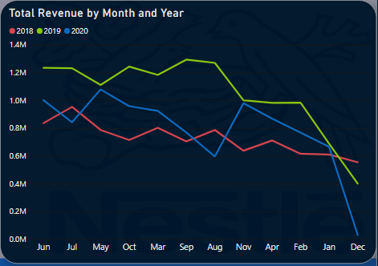
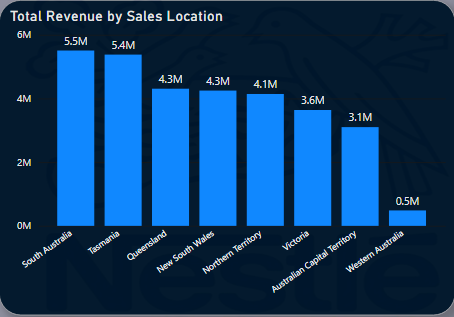
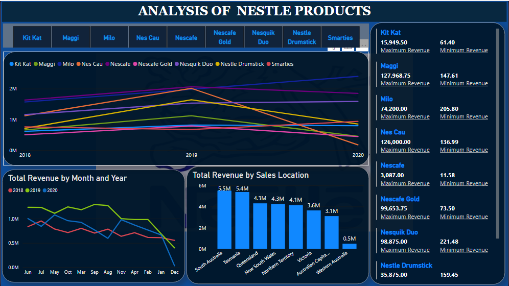

# **Case-Analysis-of-Nestle-Products**

 ## Table of contents

1. [Introduction](#introduction)
   - [Objective of the analysis](#objective-of-the-analysis)
   - [Data organization and process](#data-organization-and-process)
   
2. [Tailored Analysis](#tailored-analysis)
   - [Total sales per product in the last 3 years](#total-sales-per-product-in-the-last-3-years)
   - [The monthly and yearly sales trend](#the-monthly-and-yearly-sales-trend)
   - [Products maximum and mkinimum revenue generated](#products-maximum-and-minimum-revenue-generated)
   - [The location with the highest and lowest sales](#the-location-with-the-highest-and-lowest-sales)
   - [Overview dashboard](#overview-dashboard)
 
3. [Findings](#findings)

4. [Recommendations](#recommendations)

5. [Conclusion](#conclusion)
   

## Introduction

Nestle is one of the largest companies in the world that specializes in the manufacturing, supplying and producing food and beverages around the world. Nestle, founded in 1866, began its operations in Switzerland by its founder Henri Nestle and continues to be headquartered in Vevey, Switzerland. Since Nestle is a multinational company it also operates in almost everycountry in the world as they have operations in 187 out of 195 countries around globe (Nestlé,n.d.). Furthermore, Nestlé also has 403 functioning factories that manufacture their products around the world (How many factories do you have? n.d.).

Nestle operates in the food, beverage and tobacco industry. They manufacture  Fast-Moving Consumer Goods (FMCG). This means they produce goods that are of high demand and those that are affordable by all of their consumers. Their products are often bought off the shelves of supermarkets and stores or shops. However, because Nestle manufactures FMCG products, they tend to have multiple competitors that are of a large scale too, like, Unilever,General Mills and Kraft Foods. This means that Nestle needs to have a competitive advantage in order to make sure that they continue to have loyal consumers. They do this by having  great Research & Development, partnering with other large companies, such as, Starbucks and through joint ventures with companies like Coca-Cola. Because of these methods they have also managed to have a very wide population of consumers (Ahmed Papia, 2020).

Nestle’s tag line, “Good Food, Good Life” indicates the company’s mission as its  Mission Statement is: *world’s leading nutrition, health, and wellness company. Our mission of “Good Food, Good Life” is to provide consumers with the best tasting, most nutritious choices in  a  wide  range  of  food  and beverage  categories  and  eating occasions,  from  morning  tonight.”* This statement shows that Nestle, as a company values and prioritizes its customers, which is a vital goal of an exemplary company (Nestle Mission Statement 2020 | Nestle Mission& Vision Analysis, n.d.).

### Objective of the analysis

The company wants to expand its business by adding new product lines. The Objective of this analysis is to generate insights from the sales medium to help the company take a decision on its expansion plans. Tailored analysis will be carried out to determined the performance of the company's current products, so as to develop a product comparison dashboard of: the trend of total sales per product in the last 3 years, making products comparison based on the maximum and minimum revenue generated, developing the monthly sales trend of the product, lastly, showing which location had the highest and lowest sales lines.

### Data organization and process
The data set used for the purpose of this analysis is a public dataset available as xlsx file that explores 3 years dataset of Nestle products. The data set was provided by 10Alytics for the purpose of internship project and it contains data such as; sales ID, date, product name, total revenue, sales location, and sales medium. For the purpose of this case study and analysis, I will be using power BI. The dataset will be brought into Power BI, transform and load. Change data types, merge query, create calendar table using DAX function and close & apply.

## Tailored Analysis

### Total sales per product in the last 3 years

 Over the last 3 year, Kit Kat and maggi product made the total sales of $2.23 million respectively, milo made the total sales of $5.95 million, nes cau made total sales of $3.3 million, necafe made total sales of $5.54 milion, nescafe gold made total sales of $1.73 million, nesquik duo made $4.28 million, nestle drumstick made total sales of $3.2 million and, lastly, smarties product made total sales of $2.37 million.

| Product | 2018 sales($)| 2019 sales($) | 2020 sales($) |
|-----------|-------------------|----------|---------|
|   kit kat  |     0.61M     |   0.82M  |  0.80M        
|   maggi    |    0.66M    |      1.12M    | 0.45M
|   milo   |  1.57M  |   1.98M  |  2.40M    
|   nes cau     |        1.1M         |    2.0M  | 0.2M
|   nescafe |   1.63M   | 2.06M  | 1.85M
|   nescafe gold |   0.50M      | 0.79M  | 0.44M
|   nesquik duo  |    1.16M      |   1.53M        |1.59M
|   nestle drumstick | 0.71M  | 1.64M     | 0.85M  |
|   smarties |    0.76M     |   0.67M  |   0.94M  |                   

### The monthly and yearly sales trend

The monthly sales of this organisation has not been very steady over the 3 years trend. The figure below shows that in the 2018, the company's witnessed repeatedly rise and fall in it sales throughout the period, in 2019, the sales enhanced but with unstabe trend throughout the period (except for the month of December when it experienced a decline) surpassing 2018 and 2020 trend. Moreover, the company also witnessed an increasing and decreasing trend in the year 2020. Besides, it experienced a big fall in the month of December.  

### Products maximum and minimum revenue generated

| Product | maximum ($) | minimum ($) | 
|-----------|--------------------|-
|   kit kat  |    15,949.50      |   61.40   |        
|   maggi    |    127,968.75     |   147.61  |
|   milo     |  74,200.00        |   205.80  |    
|   nes cau  |       126,000.00  |    136.99 |
|   nescafe  |   3,087.00        |    11.58  | 
|   nescafe gold |   99,653.75   |    73.50  | 
|   nesquik duo  |    98,875.00  |   221.48  |  
|   nestle drumstick | 35,875.00 |   159.45  |
|   smarties     |    68,643.75  |   104.37  |

 Comparing the company's different products based on the maximum and minimum revenue generated. According to the dataset available, maggi product has the highest maximum of $127,968.75 revenue generated followed by nes cau product $126,000.00, and nescafe gold $99,653.75; nescafe has the least maximum of $3,087.00 revenue generated; followed by kit kat with the revenue of $15,949.50. Nesquik duo has the highest minimum revenue of $221.48 generated, followed by milo with the revenue of $205.80; nescafe has the least minimum of $11.58 revenue generated.

### The location with the highest and lowest sales

Nestle is a worldwide food producer, and as such, it has numerous production facilities and brands located in different parts of the world.

According to the dataset, South Australia has the highest sales of $5.5 million followed by Tasmania ($5.4 million), Queensland ($4.3 million), New South Wales ($4.3 million), Northern Territory ($4.1 million), Victoria ($3.6 million), Australian Capital Territory ($3.1 million), Western Australia has the lowest sales of $0.5 million.

### Overview dashboard   

[ <a href="#table-of-contents">↑ Back to top ↑</a> ]

## Findings 

Data from the sales medium shows sales in direct medium grew to the total of approximately $23.8 million, following exceptionally strong demand for Milo giving it total sales of approximately $6 million; followed by Nesquik Duo ($4 million), Nes Cau and Nestle Drumstick with total sales of approximately $3.2 million respectively; Nescafe ($2.2 million); Smarties and Maggi with total sales of approximately $2 million respectively; Nescafe Gold ($0.891 million); lastly, KitKat made low sales of approximately $0.342 million. The Online medium made the total sales of approximately $7 million led by Nescafe ($3 million), Kit Kat ($2 million), Nescafe Gold ($0.838 million), Maggi ($0.635 million), Smarties ($0.476 million) Nes Cau ($0.88 million), Nesquik Duo ($0.4 million), and Nestle Drumstick with lowest sales of approximately $0.2 million. Milo has no demand in online medium.

From the data, it can be seen that the sales from direct medium are very strong compare to the sales from online medium; giving the instance where Milo has the highest demand in direct medium but zero demand in online medium. However, Nescafe and Kit Kat made a stronger sale of approximately $3 million and $2 million in online medium compare to direct medium. The no or low sales could be as a results of poor marketing strategy, consumer insight and distribution system.

## Recommendations

There are several opportunities that can help Nestle increase the market share, revenue and in general their business operations. These involves employing multiple forms of marketing techniques which consists of six major modes of communication: advertising, sales promotion, events and experiences, public relations and publicity, direct marketing, and personal selling, to effectively reach and influence target markets. It should increase marketing efforts for the brand to increase the brand’s image and recognition. It should also consider smaller packages especially in lower middle-income economies to increase volume of sales; this will make the brand affordable to those currently with little disposable income but likely to have more as time passes like students, newly employee people and young people with families as well as young families. 

The company should increase the reach and efficiency of its distribution system where the company market the product brand like Milo more and ensure that their complex distribution system is improved to serve emerging markets and rural areas where often it fails. 

Poor consumer insight can be a threat to the company, therefore, Nestle should leverage their customer behaviour in order to provide the opportunity to better personalize and tailor products to the needs, wants, and demands of their customers, use the insights to expand their product/services offerings, develop new marketing strategies, create detailed customer personas and customer journey maps, and enhance current offerings.

Additionally, Nestle could arrange the shortest distance between customers and its regional centres, on the other hand Nestle can also arrange its transportation and regional centres to suite the customers in each area. It makes Nestle increase responsiveness and save cost as well. However, the two hubs have to be linked in term of information system, processes and transportation.  

## Conclusion

Having known the performance of the company’s current products and generating insights based on the sales medium to determine ways the company’s sales can be improved, it pointed at many things such as a good marketing strategy involving product recognition (like advisement) and branding (creating a better brand image), introducing smaller product packages, complex distribution system, leverage consumer insight, and logistic (easy transportation). These will not only improve the sales of products but it will also help the company expand its business by adding new products lines. 

 
[ <a href="#table-of-contents">↑ Back to top ↑</a> ]

